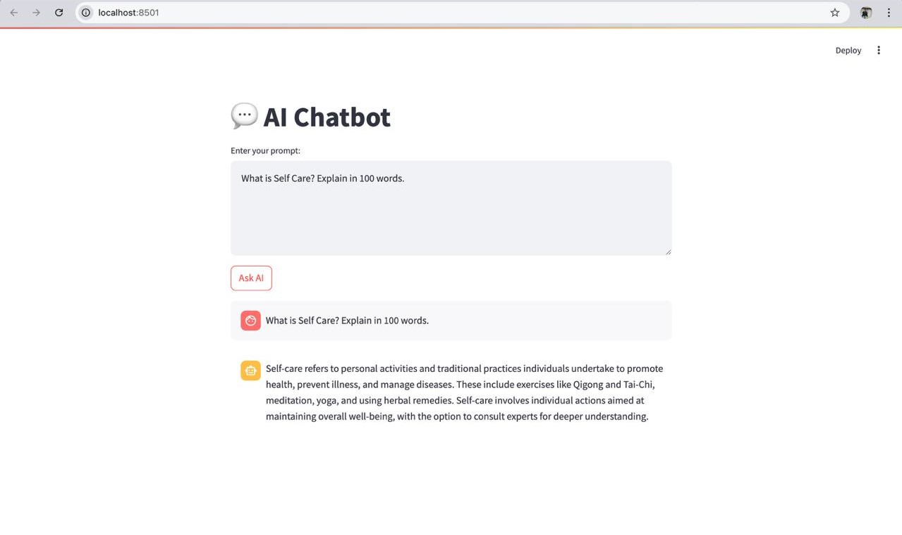
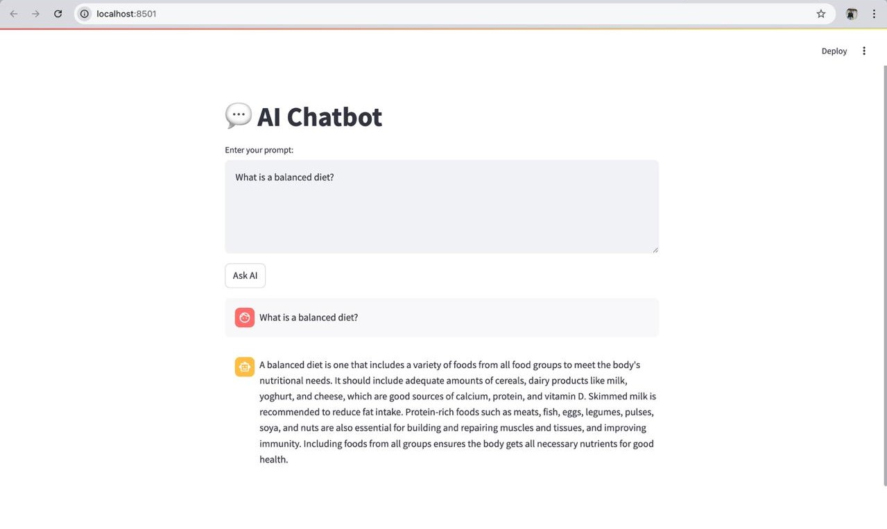

# 🩺 Medical Chatbot Project

This is an end-to-end **Medical Chatbot** powered by **RAG (Retrieval-Augmented Generation)**, **FAISS** for vector similarity search, and the **DeepSeek R1 Distill LLaMA 70B** model via **Ollama**. The UI is built with **Streamlit**.

---

## 📚 Table of Contents

- [Demo](#demo)
- [Environment Setup](#environment-setup)  
  - [Using Pipenv](#using-pipenv)  
  - [Using Conda](#using-conda)  
  - [Using Pip](#using-pip)  
- [Model Setup (DeepSeek R1)](#model-setup-deepseek-r1)
- [Running the Project](#running-the-project)  
- [Project Structure](#project-structure)

---

## 📸 Demo

| Chat Interface 1                | Model Pipeline Log  2          |
|-------------------------------|-------------------------------|
|  |  |


---

## ✅ Environment Setup

Set up the project using **Pipenv**, **Conda**, or **Pip**:

### Using Pipenv

```bash
pip install pipenv
pipenv install
pipenv shell
```

### Using Conda

```bash
conda create -n medicalchatbot python=3.9
conda activate medicalchatbot
pip install -r requirements.txt
```

### Using Pip

```bash
pip install virtualenv
virtualenv venv
```

Activate:

- **Windows:** `venv\Scripts\activate`  
- **macOS/Linux:** `source venv/bin/activate`

Then install:

```bash
pip install -r requirements.txt
```

---

## 🧠 Model Setup (DeepSeek R1)

You must **download and run** the `deepseek-r1-distill-llama-70b` model using **Ollama**:

### 1. Download Ollama

Install Ollama from: [https://ollama.com/download](https://ollama.com/download)

### 2. Pull the model

```bash
ollama pull deepseek-r1:distill-llama-70b
```

> This may take a while and requires significant system resources (GPU recommended).

### 3. Start the model

Before running the chatbot, start the model:

```bash
ollama run deepseek-r1:distill-llama-70b
```

Leave this running in a separate terminal while using the app.

---

## 🚀 Running the Project

This project includes multiple components:

### Run in development phases:

**Phase 1: UI**
```bash
streamlit run frontend.py
```

**Phase 2: Vector DB**
```bash
python vector_database.py
```

**Phase 3: RAG Pipeline**
```bash
python rag_pipeline.py
```

---

## 📁 Project Structure

```bash
medical-chatbot/
├── frontend.py            # Streamlit frontend
├── vector_database.py     # Builds FAISS vector store
├── rag_pipeline.py        # RAG querying with Ollama model
├── requirements.txt
├── images/
│   ├── demo1.png        # Screenshot of chatbot UI
│   └── demo2.png       # Screenshot of chatbot UI
└── pdfsss/
│   ├──B5084.pdf           # PDF of content
```

---

## ❓ Need Help?

Check out the official docs for:
- [Streamlit](https://docs.streamlit.io/)
- [Ollama](https://ollama.com/)
- [DeepSeek R1](https://deepseek.com/)
- [FAISS](https://github.com/facebookresearch/faiss)

---
